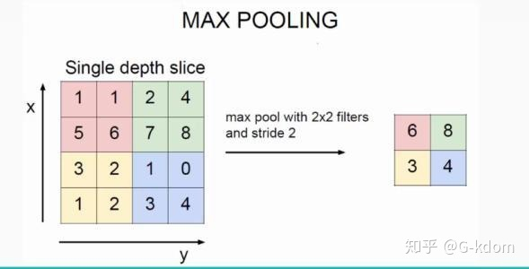
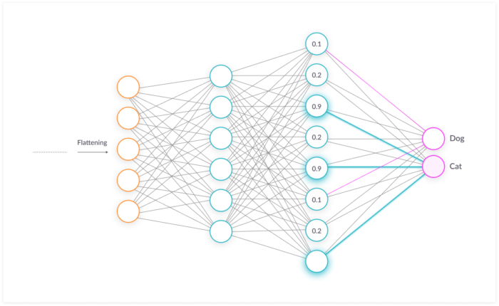
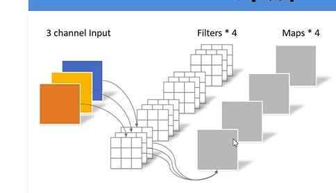
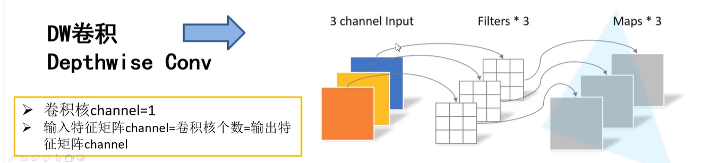

# padding, channel, stride，batch分别是什么意思

https://www.jianshu.com/p/f995a9f86aec

https://blog.csdn.net/m0_54487331/article/details/112846015
stride只有这个有

batch：为提取CPU提取一次样本的数量值

***

**注意 TensorFlow 2.0默认是eager模式，每行代码顺序执行，没有了构建图的过程（也取消了control_dependency的用法）。**

***
#tensorflow中图的概念

https://blog.csdn.net/xp15270882987/article/details/106463434/

TensorFlow是一个以图（grapgs）来表示计算的编程系统，图中的节点也被成为op（op-eration的缩写）。一个op获得零活多个张量（tensors）执行计算，产生零或多个张量。
TensorFlow 的图是一种对计算的抽象描述。在计算开始前, 图必须在 会话 (Session()) 中被启动. 会话将图的 op 分发到如 CPU 或 GPU 之类的 设备 (Devices()) 上, 同时提供执行 op 的方法。这些方法执行后, 将产生的张量 (tensor) 返回。在 Python 语言中, 将返回numpy的ndarray 对象;

通常，TensorFlow 编程可按两个阶段组织起来: 构建阶段和执行阶段; 前者用于组织计算图，而后者利session 中执行计算图中的 op 操作。

***

#静态图与动态图区别
https://mp.weixin.qq.com/s?__biz=Mzg3OTIxNjAwOQ==&mid=2247483664&idx=1&sn=bae445d1714add966f1025bdd6a3d6f4&chksm=cf0695f6f8711ce0483e910b2ddca1ae77452b26edbe3aaefe87092ed5ad21e8790a155ec07a&token=1387963449&lang=zh_CN&scene=21#wechat_redirect

在eager问世之前，TensorFlow一直采用的是静态图机制，其实直到现在TensorFlow的静态图依然大行其道。本文就来介绍一下TensorFlow的静态图机制。

何为静态图/动态图？

静态图是指在图构建之后，模型运行时无法进行修改。这里的“图”也就是模型的意思，一般一个图就是一个模型。这个图建好之后，运行前需要freeze，然后进行一些优化，例如图融合等，最后启动session根据之前构建的静态图进行计算，计算过程无法对静态图进行更改。

动态图和静态图对应，在模型运行过程中可以对图进行修改。熟悉PyTorch的朋友应该了解，因为PyTorch采用的就是动态图机制。不过一般情况，模型运行过程中也不需要对其进行修改。

另外，TensorFlow静态图带来的一个弊端就是难Debug。因为静态图在freeze后运行前会进行图优化，一些operation会被融合，所以有的operation会消失，无法在计算阶段提供断点和单步调试功能（图构建阶段能单步调试，但是只显示tensor，用处不大）。当然，断点和单步调试功能也会影响程序运行的效率。而PyTorch采用了动态图，自然有Debug方面的优势，提供了单步调试的功能，可以在计算过程查看所有tensor的值，非常直观方便。

***

**注意 TensorFlow 2.0默认是eager模式，每行代码顺序执行，没有了构建图的过程（也取消了control_dependency的用法）。**

***

# GradientTape函数的作用
https://blog.csdn.net/guanxs/article/details/102471843

没有了构建图的过程（也取消了control_dependency的用法）。但也不能每行都计算一下梯度吧？计算量太大，也没必要。因此，需要一个上下文管理器（context manager）来连接需要计算梯度的函数和变量，方便求解同时也提升效率。

# DNN中每个Conv的参数解释

kernels: 卷积核的个数，即输出的三维向量的深度

kernal_size: 卷积核的纬度

padding: 对输入像素的补充

stride: 步长，即卷积核每次移动的像素点

***
# CNN结构
## 什么是CNN
CNN是一种神经网路，专门应用于image recognition and 计算机视觉

CNN两个主要特征
1. 能够将图像细化成特征并分这些特征的析卷积/池化机制
    convolution/pooling
2. 拥有完全连接层 fully connected layer
    输入卷积/池化层的输出，可以预测描述图像的最好标签

## 什么是池化？
池化（pooling） 的本质，其实就是降采样。Pooling 对于输入的 Feature Map，选择某种方式对其进行降维压缩，以加快运算速度。

采用较多的一种池化过程叫最大池化（Max Pooling）

池化过程类似于卷积过程，如上图所示，表示的就是对一个4乘4 feature map邻域内的值，用一个 2乘2 的filter，步长为2进行‘扫描’，选择最大值输出到下一层，这叫做 Max Pooling。

max pooling常用的 s=2 ， f=2 的效果：特征图高度、宽度减半，通道数不变。

还有一种叫平均池化（Average Pooling）,就是从以上取某个区域的最大值改为求这个区域的平均值

【池化层没有参数、池化层没有参数、池化层没有参数】 （重要的事情说三遍）

池化的作用：

（1）保留主要特征的同时减少参数和计算量，防止过拟合。

（2）invariance(不变性)，这种不变性包括translation(平移)，rotation(旋转)，scale(尺度)。

Pooling 层说到底还是一个特征选择，信息过滤的过程。也就是说我们损失了一部分信息，这是一个和计算性能的一个妥协，随着运算速度的不断提高，我认为这个妥协会越来越小。

现在有些网络都开始少用或者不用pooling层了。

## CNN VS Fully Connected Neural Networks
全连接层与全连接神经网络不一样，后者是经典的神经网络架构
在全连接神经网络中某层的所有神经元都会连接到下一层的所有神经元

计算机视觉任务的特点就是输入很庞大（3颜色通道，大量像素点）

CNN利用了一张图像是由更小的细节或者特征组成的这一事实。CNN创建了一种机制，用于分离并分析每个特征，从而判断整个图像

## CNN layers 分类
1. 卷积层

可以看作通过图像的滤波器。一次扫描几个像素，并创建一个特征映射来预测每个特征所属的类别

2. 池化层

只保留从卷积层中获得的最重要的信息（卷积+池化经常要循环好多轮）

3. 全连接输入层

接收前层的输出，将其展开（变为一维）并将展开的特征放入一个vector中，这个vector就是下一阶段的输入

4. 第一个全连接层

接收之前已经展开的特征值，分析并应用这些权重（特征）来预测正确的label

5. 全连接输出层

给出各预测后label的正确概率  

## 全连接层作用
全连接层的目标是take the results of the convolution/pooling process 并使用这些results来classify the image into a label
（在一个简单的分类例子中）

卷积/池化层的输出被展开为一维向量，向量中的每一个值都代表一个确定的特征是属于某label的概率
例如，如果图像中是一只猫，代表诸如胡须、皮毛等的features就会有很高的概率被归类到label "cat"

上图展示了输入值是如何流入第一层神经元的。输入值与第一层的权重相乘，然后通过了一个激活函数（典型如ReLu）。
就像在经典的artificial neural network中那样。这些值之后继续向输出层前进，在输出层每一个神经元都代表一种分类label

CNN中的完全连接部分通过自己的反向传播过程来决定最精确的权重。
每一个神经元都会收到被优化到最合适的权重。最后所有神经元将会“投票”决定哪一个label是分类结果

# 训练过程中的概念
epoch: 轮，即整个训练集被训练了多少次
batch: 每迭代一次CPU提取的图片数量
total_images / batch: 每一epoch的迭代次数

# MobileNet目的

Vgg、Res等的权重文件都太大了，为了在嵌入式设备上部署深度学习模型，发明了MobileNet, 
大大减少了模型参数数量与运算量

MobileNet两个两点
1. Depthwise Convolution(大大减少运算量和参数数量)
2. 增加超参数a, b
    a控制卷积层卷积核个数；b控制输入图像大小
    这两个参数是自定的，不是学习到的
    
# MobileNet详解

## 传统CNN的卷积

传统卷积中，输入是三个矩阵，那么一个卷积核深度为3，经过这个卷积层后的输出个数为卷积核个数4

卷积核channel数量 = 输入特征矩阵channel数量
输出特征矩阵数量 = 卷积核个数

DW卷积如下：
    

# 查看 tensor的值
训练后产生的 loss和 accuracy都是tf.tensor类型
在tf 1代中可以使用 tf.Session来查看tensor数值
在tf 2代中没有 Session了，使用 tensor.numpy()即可查看其数值

# tensorflow2.0 的训练方法
在TensorFlow2.0中，训练一个神经网络模型主要有两种方式：
1. 使用tf.keras模块的Model.fit()；
2. 使用tf.GradientTape()求解梯度，这样可以自定义训练过程