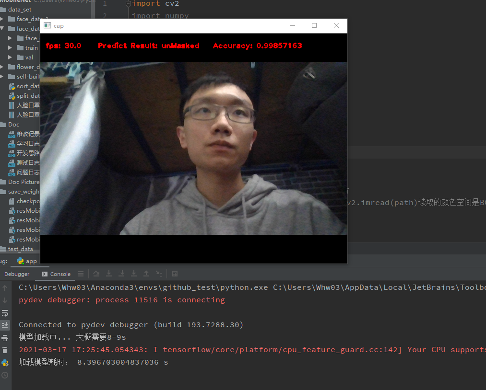
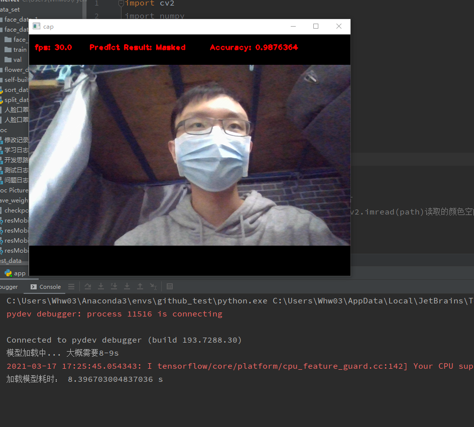

#项目简介
这是一个人脸口罩识别的小项目

用的是经典的 mobilenetv2网络，能够调用电脑的摄像头实时判断摄像头前的人是否配套口罩<br>
图像上方会实时显示当前摄像头的帧率、预测的结果（摄像头里的人带不带口罩）以及预测的准确率

# 环境
python 3.7<br>
tensorflow 2.1.0 (至少2以上)<br>
opencv3.4.2

本项目使用于 win10<br>
推荐使用 pycharm + anaconda3 配置环境

# Quick Start
运行 app.py

在模型加载完成后（需要一点时间），程序就会开始运行

#如何换模型进行预测
本项目目前训练了两个模型，训练后的模型权重值（ckpt文件）全部位于save_weights中
> resMobileNetV2.ckpt.data-0000-of-0001
>
> resMobileNetV2.ckpt.index

> resMobileNetV2.ckpt.data-0000-of-0001
>
> resMobileNetV2.ckpt.index

除了checkpoint之外，每个模型都有两个文件，一个是XXX.ckpt.data-0000-of-0001 和 XXX.ckpt.index

如果要修改预测所需的模型:<br>
在 predict.py 中修改 weights_path 的值

注意 修改时应该写 resMobileNetV2.ckpt 或是 resMobileNetV2.ckpt<br>
其余后缀不用加
<br>
<br>

注意，预测时的模型搭建必须与训练时一样
```C
feature = MobileNetV2(num_classes=num_classes, include_top=False)
model = tf.keras.Sequential([feature,
                             tf.keras.layers.GlobalAvgPool2D(),
                             tf.keras.layers.Dropout(rate=0.5),
                             tf.keras.layers.Dense(num_classes),
                             tf.keras.layers.Softmax()])
...
assert len(glob.glob(weights_path + "*")), "cannot find {}".format(weights_path)
model.load_weights(weights_path)

```

# 如何用新的数据集训练
本项目的数据集位于 data_set 文件夹中，目前有两个数据集，face_data_1比较小，face_data_2比较大

新的数据集应该放入data_set中，目录结构如下：
> data_set
>> ...
>>
>> data_root
>>> your_data_set_dir
>>>> calss_1
>>>>
>>>> class_2
>>>>
>>>> ...

首先修改 class_indices.json 中的分类
<br>
<br>

然后，需要划分训练集和数据集，在 split_data.py 中修改 my_data_root 为上述结构中的 data_root，
修改 my_origin_face_path 为上述结构中的 your_data_set_dir<br>

运行 split_data.py, 会多出 train 和 val 两个文件夹，得到的目录应该如下所示：
> data_set
>> ...
>>
>> data_root
>>> your_data_set_dir
>>>> calss_1
>>>>
>>>> class_2
>>>>
>>>> ...
>>> 
>>> train
>>>>calss_1
>>>>
>>>> class_2
>>>>
>>>> ...
>>> 
>>> val
>>>> calss_1
>>>>
>>>> class_2
>>>>
>>>> ...
>>> 

顾名思义，train 文件夹存放着训练集，val 文件夹存放着验证集

默认分10% 的数据作为验证集，如果想修改，修改 main函数中的 split_rate
<br>
<br>

接着，在train_mobilenet_v2.py中修改如下值：
1. 修改 img_data_dir 为上述结构中的data_root
2. 修改 save_weights_path 为你想要保存的权重文件路径

本项目基于迁移学习的方法进行训练，默认是采用tensorlfow官网提供的预训练模型，此模型位于
tf_mobilenet_weights 文件夹中，如果想要使用自己的预训练模型，
在 train_mobilenet_v2.py 的main函数中修改 pre_weights_path 

# 运行情况展示




# 其他
1. 运行程序时可能会报错 Your CPU supports instructions that this TensorFlow binary was not compiled to use: AVX AVX2
<br> 这是因为tensorflow的版本不对，但是无伤大雅，不影响程序运行

2. Doc文件夹中存放着本项目的问题日志, 如果程序运行时发生了什么问题可以去搜一下


# 作者介绍
吴黄巍<br>四川大学电子信息学院18级 